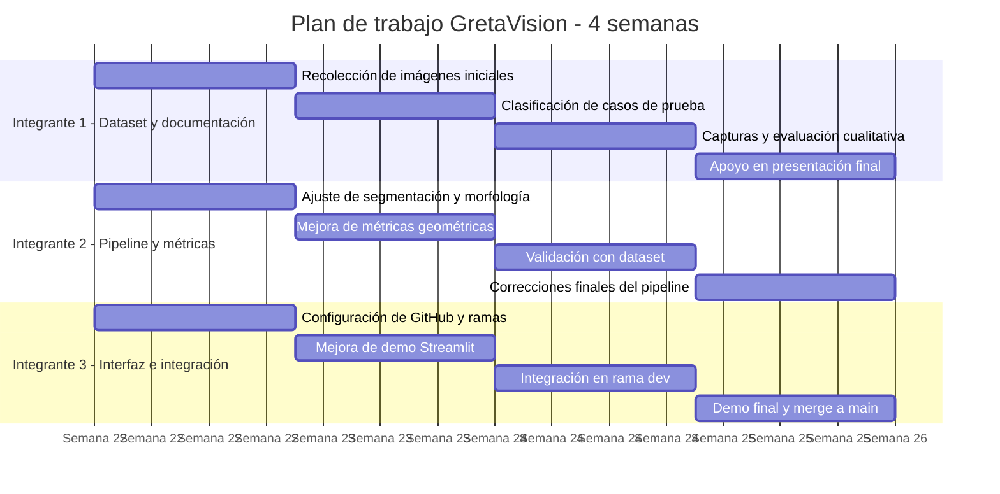

# GretaVision - MVP de Computación Gráfica

GretaVision es un MVP académico para la **segmentación, medición aproximada y visualización de regiones candidatas a grietas** en imágenes 2D de pavimento o concreto.

El sistema permite cargar una imagen, aplicar preprocesamiento, segmentar posibles grietas, limpiar la máscara binaria, calcular métricas geométricas en píxeles y visualizar los resultados mediante máscara, overlay y mapa de calor.

> **Advertencia académica:** GretaVision no realiza diagnóstico estructural profesional. Las métricas generadas son visuales y aproximadas. Sin calibración física, todas las medidas se reportan en píxeles.

## Objetivo del proyecto

El objetivo principal es construir una herramienta académica de apoyo visual para analizar imágenes de superficies con posibles grietas, aplicando técnicas de computación gráfica y procesamiento digital de imágenes.

El sistema busca demostrar:

1. Carga de imágenes de pavimento o concreto.
2. Preprocesamiento para reducción de ruido y mejora de contraste.
3. Segmentación de regiones oscuras candidatas a grietas.
4. Limpieza de máscara mediante operaciones morfológicas.
5. Filtrado de componentes conectados.
6. Cálculo de métricas geométricas aproximadas.
7. Visualización mediante overlay y mapa de calor.
8. Exportación de métricas en CSV/JSON.
9. Demo funcional mediante Google Colab y Streamlit.


## 1. Funcionalidades actuales

* Carga de imágenes en formato JPG, JPEG o PNG.
* Preprocesamiento:

  * conversión a escala de grises;
  * reducción de ruido;
  * mejora de contraste.
* Segmentación por umbral adaptativo inverso.
* Limpieza morfológica de la máscara.
* Filtrado de componentes conectados.
* Cálculo de métricas aproximadas:

  * área en píxeles;
  * centroide;
  * bounding box;
  * longitud estimada;
  * grosor promedio;
  * grosor máximo;
  * orientación aproximada;
  * severidad visual.
* Visualización:

  * imagen original;
  * imagen preprocesada;
  * máscara refinada;
  * overlay;
  * mapa de calor.
* Exportación:

  * overlay PNG;
  * máscara PNG;
  * heatmap PNG;
  * métricas CSV;
  * reporte JSON.


## 2. Tecnologías utilizadas

* Python
* OpenCV
* NumPy
* Pandas
* Matplotlib
* scikit-image
* Streamlit
* Google Colab
* Git/GitHub


## 3. Instalación local

Clonar el repositorio:

```bash
git clone https://github.com/AlanEspinozaH/GretaVision-CompuGrafica.git
cd GretaVision-CompuGrafica
```

Crear entorno virtual:

```bash
python -m venv .venv
```

Activar entorno virtual en Linux/macOS:

```bash
source .venv/bin/activate
```

Activar entorno virtual en Windows:

```bash
.venv\Scripts\activate
```

Instalar dependencias:

```bash
pip install -r requirements.txt
```

Ejecutar la aplicación:

```bash
streamlit run app_streamlit.py
```


## 4. Ejecución rápida en Google Colab

Abrir el notebook:

```text
notebooks/GretaVision_MVP_Colab.ipynb
```

Luego ejecutar las celdas y subir una imagen de prueba.

Esta opción se recomienda para validar rápidamente el pipeline sin instalar dependencias localmente.


## 5. Estructura del proyecto

```text
GretaVision-CompuGrafica/
├── app_streamlit.py
├── requirements.txt
├── README.md
├── .gitignore
├── src/
│   └── pipeline.py
├── notebooks/
│   └── GretaVision_MVP_Colab.ipynb
├── data/
│   └── input/
│       └── .gitkeep
├── results/
│   └── .gitkeep
└── docs/
    └── plan_avance.md
```


## 6. Flujo general del pipeline

```text
Imagen RGB
→ Escala de grises
→ Reducción de ruido
→ Mejora de contraste
→ Umbral adaptativo inverso
→ Operaciones morfológicas
→ Componentes conectados
→ Filtrado geométrico
→ Skeletonization
→ Distance Transform
→ Métricas
→ Overlay / Heatmap / Exportación
```


## 7. Distribución de trabajo

| Integrante   | Rama sugerida               | Responsabilidad principal                            | Archivos principales                                       |
| ------------ | --------------------------- | ---------------------------------------------------- | ---------------------------------------------------------- |
| Integrante 1: Merchan Bianca | `feature/dataset-docs`      | Dataset, pruebas, capturas y documentación breve     | `data/input/`, `docs/plan_avance.md`, `README.md`          |
| Integrante 2: Guerrero Jhiens| `feature/pipeline-metricas` | Pipeline, segmentación, postprocesamiento y métricas | `src/pipeline.py`, `notebooks/GretaVision_MVP_Colab.ipynb` |
| Integrante 3: Espinoza Alan | `feature/streamlit-demo`    | Interfaz, visualización, GitHub e integración        | `app_streamlit.py`, `requirements.txt`, `README.md`        |


## 8. Ramas de trabajo

El repositorio usa el siguiente flujo:

```text
main
dev
feature/streamlit-demo
feature/pipeline-metricas
feature/dataset-docs
docs/presentacion
```

Descripción:

* `main`: versión estable del proyecto.
* `dev`: rama de integración.
* `feature/streamlit-demo`: desarrollo de la interfaz y demo.
* `feature/pipeline-metricas`: mejoras del pipeline y métricas.
* `feature/dataset-docs`: dataset, pruebas, capturas y documentación.
* `docs/presentacion`: presentación e informe final.

Flujo recomendado:

```text
feature/... → dev → main
```

No se debe trabajar directamente sobre `main`.


## 9. Comandos básicos para colaboradores

Clonar repositorio:

```bash
git clone https://github.com/AlanEspinozaH/GretaVision-CompuGrafica.git
cd GretaVision-CompuGrafica
```

Cambiar a una rama de trabajo:

```bash
git checkout nombre-de-rama
```

Actualizar rama:

```bash
git pull origin nombre-de-rama
```

Guardar cambios:

```bash
git status
git add .
git commit -m "descripcion breve del cambio"
git push origin nombre-de-rama
```

Ejemplo:

```bash
git checkout feature/dataset-docs
git pull origin feature/dataset-docs
git add .
git commit -m "docs: agrega descripcion del dataset inicial"
git push origin feature/dataset-docs
```


## 10. Plan de trabajo restante


El alcance propuesto es consolidar un MVP funcional con procesamiento clásico, visualización, métricas y documentación técnica. No se contempla entrenamiento de modelos deep learning ni reconstrucción 3D real.

### Diagrama de Gantt



> Ajustar las fechas según el calendario real del curso.


## 11. Alcance final esperado

Para la entrega final, el sistema debe permitir:

* cargar una imagen;
* ejecutar el pipeline de procesamiento;
* visualizar máscara, overlay y heatmap;
* mostrar tabla de métricas;
* exportar resultados en CSV/JSON;
* documentar casos exitosos y limitaciones;
* ejecutar una demo funcional en Streamlit;
* mantener un repositorio ordenado en GitHub.


## 12. Fuera de alcance

Por restricciones de tiempo, quedan fuera del alcance:

* diagnóstico estructural profesional;
* medición física en milímetros sin calibración;
* reconstrucción 3D real;
* entrenamiento de modelos deep learning;
* segmentación supervisada con ground truth pixel a pixel;
* validación cuantitativa exhaustiva.


## 13. Convención de commits

Se recomienda usar commits breves y descriptivos:

```text
feat: nueva funcionalidad
fix: corrección de error
docs: documentación
refactor: reorganización de código
test: pruebas o casos de evaluación
chore: configuración o cambios menores
```

Ejemplos:

```bash
git commit -m "feat: agrega filtrado geometrico de componentes conectados"
git commit -m "docs: documenta limitaciones del MVP"
git commit -m "fix: corrige visualizacion del mapa de calor"
```
